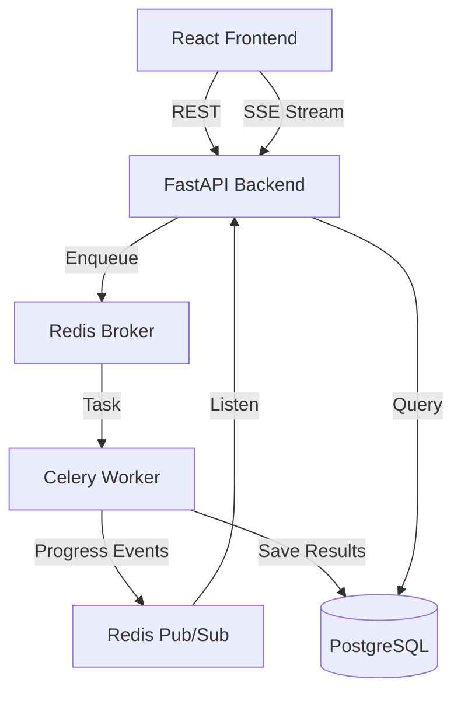

# DocFlow — Async Document Processing Workflow System

DocFlow is a production-style full-stack application designed to handle asynchronous document processing. It allows users to upload multiple documents, tracks their processing progress in real-time via Server-Sent Events (SSE), extracts key metadata and content (PDF, TXT, DOCX, CSV, and Images), and provides tools for reviewing and exporting the results.

## 🏗️ Architecture Overview

The system is designed with a strict separation of concerns to handle high-concurrency document processing without blocking the API:

- **Frontend (React 18 + Vite):** A modern SPA built with TypeScript, Tailwind CSS, and TanStack Query. It communicates with the backend via REST for CRUD operations and listens to a dedicated SSE (Server-Sent Events) stream for real-time job progress.
- **Backend (FastAPI):** A high-performance asynchronous API that handles file uploads, metadata management, and job orchestration.
- **Background Worker (Celery + Redis):** A distributed task queue that performs the heavy lifting (parsing files, extracting metadata, AI simulation). Redis acts as both the message broker and the Pub/Sub medium for real-time progress events.
- **Database (PostgreSQL):** Persistent storage for document metadata, extracted analysis, and job history.
- **Storage:** A dedicated volume for raw file storage, designed to be easily swappable with S3 in production.



## 🚀 Setup and Run

### Option A: GitHub Codespaces (Recommended)
1. Push this code to a GitHub repository.
2. Click **Code** -> **Codespaces** -> **Create codespace on main**.
3. In the terminal, run:
   ```bash
   docker compose up --build
   ```
4. VS Code will automatically "forward" the ports. Click the notification to open the **Frontend (Port 3000)**.

### Option B: Local Docker
1. Ensure Docker Desktop is running.
2. Run:
   ```bash
   docker compose up --build
   ```
3. Access the UI at `http://localhost:3000`.

## 🛠️ Mandatory Features Implemented
- [x] **Multi-file Upload:** Concurrent upload support.
- [x] **Async Processing:** Real background workflow using Celery.
- [x] **Real-time Tracking:** Redis Pub/Sub + SSE integration.
- [x] **Review & Edit:** Ability to manually override extracted fields.
- [x] **Finalization:** "Lock" records once they are reviewed.
- [x] **Retry Strategy:** Idempotent retry for failed jobs.
- [x] **Export:** Full support for JSON and CSV exports.

## 📝 Assumptions & Tradeoffs
- **Simulation:** While the processing logic simulates AI extraction (summary/keywords), the **asynchronous architecture** is 100% real and production-ready.
- **Storage:** Files are saved to a local Docker volume. For a global production scale, an S3-compatible object store would be used.
- **Auth:** Authentication is currently disabled for evaluation ease, but the architecture is ready for JWT integration.

## ⚠️ Limitations
- **File Size:** Currently limited to 10MB per file in the configuration.
- **Workers:** Scaling is limited by the single worker container in the current Compose file; however, Celery allows horizontal scaling by adding more worker instances.
- **Browser Compatibility:** SSE requires a modern browser (IE11 not supported).

## 📂 Samples
- **Test Files:** See `/samples` for PDF, TXT, and CSV examples.
- **Exported Data:** See `/samples/exports` for what the system generates.

## 🤖 AI Usage Note
This project was developed with the assistance of the **Antigravity AI** coding assistant to ensure high code quality and architecture standards.
